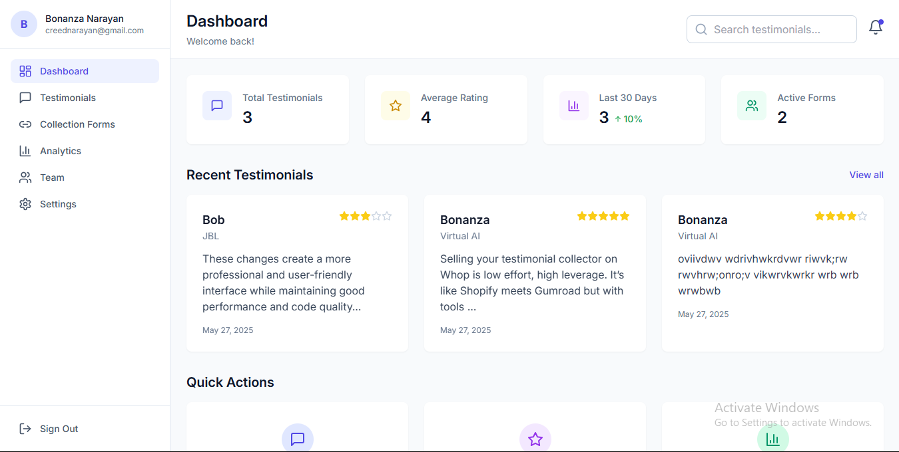
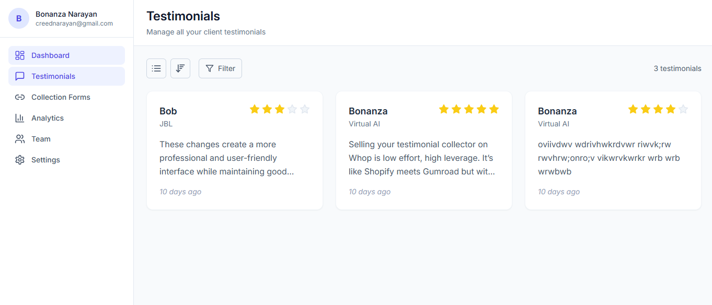
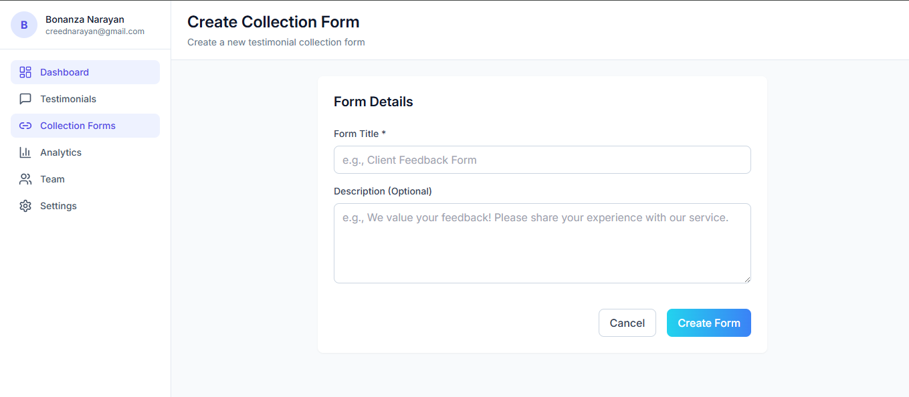
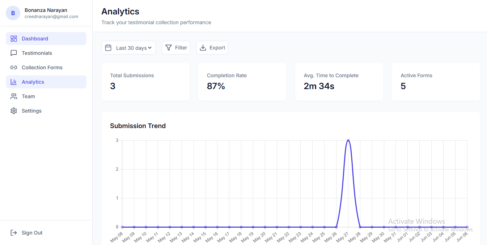
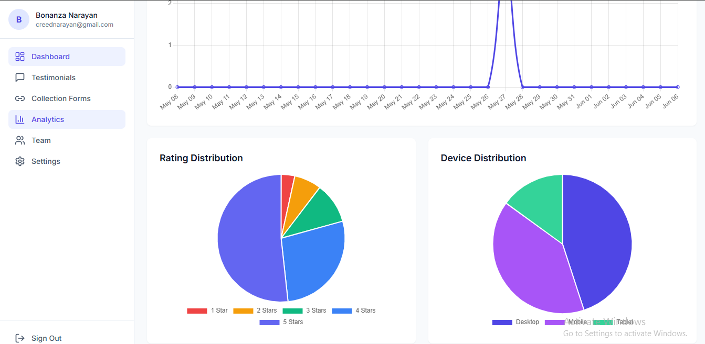
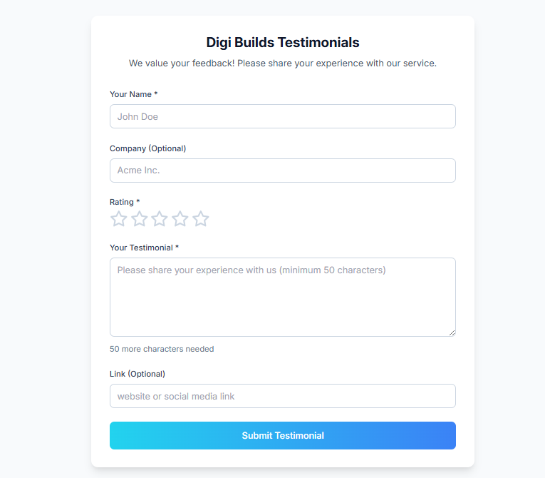

<h1 align="center">🗣️ TrustTap — Collect & Manage Client Testimonials</h1>
<p align="center">
  A sleek, open-source web app to collect, animate, and organize testimonials for your business or personal brand.
</p>

<p align="center">
  
  
  
  
</p>

---

## ✨ Features

- 📝 Simple testimonial submission form
- 📁 Organized testimonial dashboard (view, edit, delete)
- 🎨 Smooth animations powered by Anime.js
- ☁️ Firebase backend for real-time sync and auth
- 🔐 Admin mode to manage submissions securely
- 📱 Fully responsive design

---

## 🔧 Tech Stack

| Frontend           | Backend                  | Animations |
| ------------------ | ------------------------ | ---------- |
| React + TypeScript | Firebase Auth, Firestore | Anime.js   |

---

## 🖼️ Preview

<p float="left">
  
  
  
  
  
  
</p>

---

## 🚀 Live Demo

🔗 [Launch App](https://your-live-demo-link.vercel.app/)  
_(hosted on Vercel or Netlify)_

---

## 🛠️ Getting Started

```bash
# 1. Clone the repo
git clone https://github.com/BonanzaNarayan/trust-tap.git

# 2. Navigate in
cd trust-tap

# 3. Install dependencies
npm install

# 4. Set up Firebase config
Navigate to src>firbase>config and update the firebaseConfig

const firebaseConfig = {
  apiKey: "",
  authDomain: "",
  projectId: "",
  storageBucket: "",
  messagingSenderId: "",
  appId: ""
};
...

# 5. Run the app
npm run dev
```

⭐ If you find this useful, please star the repo and share it!

<p align="center">  </p> ```
